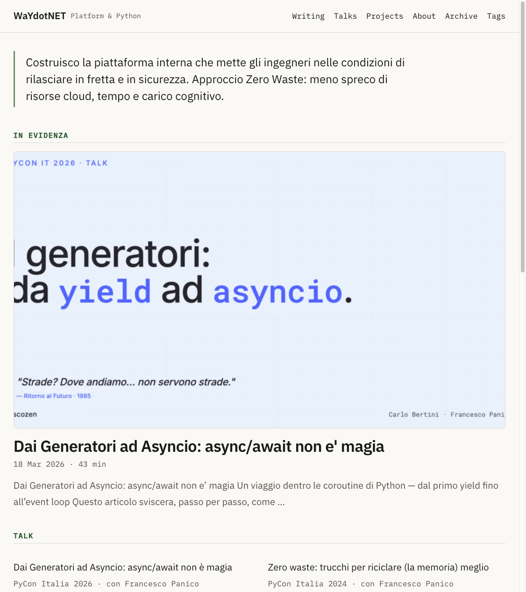

# Zero Waste — Hugo theme

A **zero-waste, paper & ink** Hugo theme: minimal, fast, accessible (WCAG AAA on
text), and i18n-ready. Built around an editorial "Carta & Inchiostro" aesthetic
(warm ivory + ink + sage accent) with **IBM Plex Sans + Mono** self-hosted.



## Features

- Editorial homepage: featured article (cover), talks and projects bands, latest posts
- Sticky top navigation, comfortable reading width for articles
- **IBM Plex Sans + Mono** self-hosted (no Google Fonts at runtime → privacy + performance)
- **Syntax highlighting** (Chroma, GitHub light) with copy-to-clipboard buttons
- **Accessibility**: AAA text contrast, visible focus, `prefers-reduced-motion`, semantic markup
- **i18n-ready**: all UI strings via `i18n` (it/en provided), language switcher
- Taxonomies (categories, tags), archives, talks & projects pages from data files
- Fast: minimal CSS, fingerprinted assets, responsive images friendly

## Requirements

- Hugo **extended**, **v0.146.0** or newer (taxonomy term layout lookup + asset pipeline).

## Installation (Hugo Modules — recommended)

```bash
hugo mod init github.com/you/your-site
```

```yaml
# hugo.yaml
module:
  imports:
    - path: github.com/WaYdotNET/hugo-zero-waste
```

```bash
hugo mod get -u github.com/WaYdotNET/hugo-zero-waste
```

Alternatively, clone into `themes/` and set `theme: zero-waste`.

## Configuration

```yaml
params:
  brand: "WaYdotNET"                 # header brand text
  brandCaption: "Platform & Python"  # small caption next to the brand
  description: "Your site description"
  footer:
    text: "Your footer tagline"
  homeProfile:
    bio: "A short manifesto, rendered as a lead quote on the home."
    latestCount: 5
  socialIcons:                       # icons: github, linkedin, x, email, rss
    - { name: github,  url: "https://github.com/you" }
    - { name: email,   url: "you@example.com" }      # rendered as mailto:
```

Talks and projects on the homepage / pages come from **site data files**:

```yaml
# data/talks.yaml
- title: "My talk"
  event: "PyCon 2026"
  with: "Co-speaker"        # optional
  url: "/posts/my-talk/"
  slides: "/pdf/slides.pdf" # optional

# data/projects.yaml
- name: "My project"
  desc: "Short description."
  url: "/posts/my-project/"
```

Add `/talks/` and `/projects/` pages with `layout: talks` / `layout: projects`.

## Customizing colors & fonts

All design tokens are CSS custom properties (`assets/css/tokens.css`) and can be
overridden in your site's own CSS:

```css
:root {
  --zw-bg: #FAF9F6;          /* page background */
  --zw-ink: #1a1a1a;         /* text */
  --zw-muted: #57534b;       /* secondary text (AAA) */
  --zw-accent: #6B8E6B;      /* decorative accent (underlines/borders) */
  --zw-accent-text: #2f5a2f; /* accent for text/labels (AAA) */
  --zw-maxw: 1120px;         /* content width */
  --zw-readw: 46rem;         /* article reading width */
}
```

## License

[MIT](LICENSE) © Carlo Bertini (WaYdotNET)
